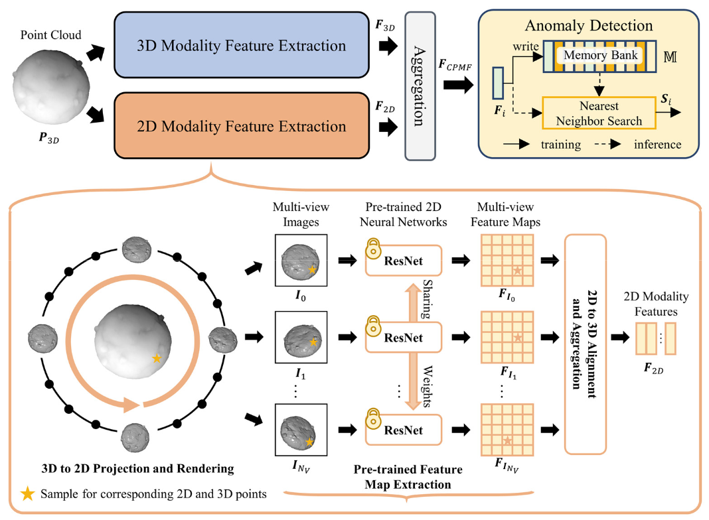
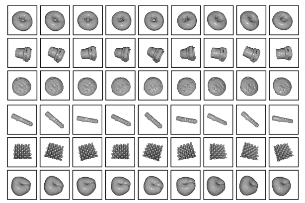
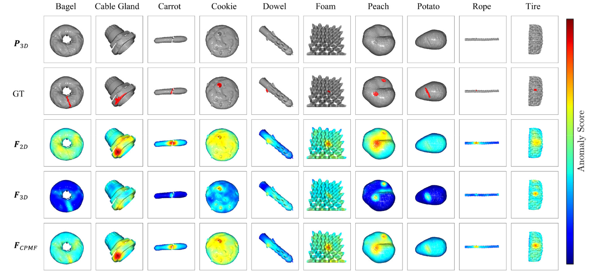

# Complementary Pseudo Multimodal Feature for Point Cloud Anomaly Detection
### [Paper](https://arxiv.org/abs/2303.13194) <br>
[](https://paperswithcode.com/sota/depth-anomaly-detection-and-segmentation-on?p=complementary-pseudo-multimodal-feature-for)
[](https://paperswithcode.com/sota/3d-anomaly-detection-and-segmentation-on?p=complementary-pseudo-multimodal-feature-for)

Official PyTorch Implementation for the "Complementary Pseudo Multimodal Feature for Point Cloud Anomaly Detection" paper.  


___

> **Complementary Pseudo Multimodal Feature for Point Cloud Anomaly Detection**<br>
> Yunkang Cao, Xiaohao Xu, Weiming Shen<br>
> https://arxiv.org/abs/2303.13194 <br>
>
>**Abstract:** Point cloud (PCD) anomaly detection steadily emerges as a promising research area. 
> This study aims to improve PCD anomaly detection performance by combining handcrafted PCD descriptions 
> with powerful pre-trained 2D neural networks. 
> To this end, this study proposes Complementary Pseudo Multimodal Feature (CPMF) that incorporates local 
> geometrical information in 3D modality using handcrafted PCD descriptors and global semantic information in 
> the generated pseudo 2D modality using pre-trained 2D neural networks. For global semantics extraction, 
> CPMF projects the origin PCD into a pseudo 2D modality containing multi-view images. 
> These images are delivered to pre-trained 2D neural networks for informative 2D modality feature extraction. 
> The 3D and 2D modality features are aggregated to obtain the CPMF for PCD anomaly detection. 
> Extensive experiments demonstrate the complementary capacity between 2D and 3D modality features and the 
> effectiveness of CPMF, with 95.15% image-level AU-ROC and 92.93% pixel-level PRO on the MVTec3D benchmark.
#### Framework


#### Rendered Samples
Our method uses open-3d for rendering, and here are some sample results.


#### Qualitative Results
Here are the qualitative results of our method.



## Getting Started

### Setup 
1.  Clone the repo:
```bash
git https://github.com/caoyunkang/CPMF
cd CPMF
```
2. Create a new environment and install the libraries:
```bash
conda create -n 3d_cpmf python=3.7
conda activate 3d_cpmf
sh init.sh
```
3. Download and extract the dataset
```bash
data_dir=../datasets/mvtec_3d
cd $data_dir # data dir for the dataset
wget https://www.mydrive.ch/shares/45920/dd1eb345346df066c63b5c95676b961b/download/428824485-1643285832/mvtec_3d_anomaly_detection.tar.xz
mkdir mvtec_3d
tar -xvf mvtec_3d_anomaly_detection.tar.xz -c ./mvtec_3d
```
4. preprocess datasets. i.e., remove backgrounds and then render multi-view images.
```bash
sh preprocess_dataset.sh
```
<br>
<br>


### Training
To run on a single category:
```bash
python main.py --category  bagel --n-views 27 --no-fpfh False --data-path $data_dir --exp-name $exp_name --backbone resnet18
```
To reproduce the experiments. Note: please make sure the directories are properly set.
```bash
python run_exp.py
```

#### Image ROCAUC Results

| Method     | Bagel  | Cable Gland | Carrot | Cookie | Dowel | Foam  | Peach | Potato | Rope  | Tire  | Mean   |
|------------|--------|-------------|--------|--------|-------|-------|-------|--------|-------|-------|--------|
| Voxel GAN  | 0.3830 | 0.6230      | 0.4740 | 0.6390 | 0.5640| 0.4090| 0.6170| 0.4270 | 0.6630| 0.5770| 0.5376 |
| Voxel AE   | 0.6930 | 0.4250      | 0.5150 | 0.7900 | 0.4940| 0.5580| 0.5370| 0.4840 | 0.6390| 0.5830| 0.5718 |
| Voxel VM   | 0.7500 | 0.7470      | 0.6130 | 0.7380 | 0.8230| 0.6930| 0.6790| 0.6520 | 0.6090| 0.6900| 0.6994 |
| Depth GAN  | 0.5300 | 0.3070      | 0.6010 | 0.6030 | 0.4970| 0.4840| 0.5250| 0.4890 | 0.6090| 0.5360| 0.5233 |
| Depth AE   | 0.4680 | 0.7310      | 0.4970 | 0.6730 | 0.5340| 0.4170| 0.4850| 0.5490 | 0.5640| 0.5460| 0.5464 |
| Depth VM   | 0.5100 | 0.5420      | 0.4690 | 0.5760 | 0.6090| 0.6990| 0.4500| 0.4190 | 0.6680| 0.5200| 0.5462 |
| AST        | 0.8810 | 0.5760      | 0.9560 | 0.9570 | 0.6790| 0.7970| **0.9900**| 0.9150 | 0.9560| 0.6110| 0.8318 |
| BTF (Depth iNet) | 0.6860 | 0.5320  | 0.7690 | 0.8530 | 0.8570| 0.5110| 0.5730| 0.6200 | 0.7580| 0.5900| 0.6749 |
| BTF (Raw)   | 0.6270 | 0.5060     | 0.5990 | 0.6540 | 0.5730| 0.5310| 0.5310| 0.6110 | 0.4120| 0.6780| 0.5722 |
| BTF (HoG)   | 0.4870 | 0.5880     | 0.6990 | 0.5460 | 0.6430| 0.5930| 0.6160| 0.5840 | 0.5060| 0.4290| 0.5582 |
| BTF (SIFT)  | 0.7110 | 0.6560     | 0.8920 | 0.7540 | 0.8280| 0.6860| 0.6220| 0.7540 | 0.7670| 0.5980| 0.7268 |
| BTF (FPFH)  | 0.8250 | 0.5510     | 0.9520 | 0.7970 | 0.8830| 0.5820| 0.7580| 0.8890 | 0.9290| 0.6530| 0.7819 |
| CPMF       | **0.9830** | **0.8894**      | **0.9885** | **0.9910** | **0.9578**| **0.8094**| 0.9884| **0.9590** | **0.9792**| **0.9692**| **0.9515** |

#### AU PRO Results
| Method     | Bagel  | Cable Gland | Carrot | Cookie | Dowel | Foam  | Peach | Potato | Rope  | Tire  | Mean   |
|------------|--------|-------------|--------|--------|-------|-------|-------|--------|-------|-------|--------|
| Voxel GAN  | 0.4400 | 0.4530      | 0.8250 | 0.7550 | 0.7820| 0.3780| 0.3920| 0.6390 | 0.7750| 0.3890| 0.5828 |
| Voxel AE   | 0.2600 | 0.3410      | 0.5810 | 0.3510 | 0.5020| 0.2340| 0.3510| 0.6580 | 0.0150| 0.1850| 0.3478 |
| Voxel VM   | 0.4530 | 0.3430      | 0.5210 | 0.6970 | 0.6800| 0.2840| 0.3490| 0.6340 | 0.6160| 0.3460| 0.4923 |
| Depth GAN  | 0.1190 | 0.0420      | 0.2120 | 0.1740 | 0.1630| 0.1070| 0.0730| 0.0420 | 0.4640| 0.0750| 0.1423 |
| Depth AE   | 0.1470 | 0.0690      | 0.2930 | 0.2170 | 0.2070| 0.1810| 0.1640| 0.0660 | 0.5450| 0.1420| 0.2031 |
| Depth VM   | 0.2800 | 0.3740      | 0.2430 | 0.5260 | 0.4850| 0.3140| 0.1990| 0.3880 | 0.5430| 0.3850| 0.3737 |
| 3D-ST128   | 0.9500 | 0.4830  | **0.9860** | **0.9210** | 0.9050| 0.6320| 0.9450| **0.9880** | **0.9760**| 0.5420| 0.8328 |
| BTF (Depth iNet) | 0.7690 | 0.6640  | 0.8870 | 0.8800 | 0.8640| 0.2690| 0.8760| 0.8650 | 0.8520| 0.6240| 0.7550 |
| BTF (Raw)   | 0.4010 | 0.3110     | 0.6380 | 0.4980 | 0.2500| 0.2540| 0.5270| 0.5300 | 0.8080| 0.2010| 0.4418 |
| BTF (HoG)   | 0.7110 | 0.7630     | 0.9310 | 0.4970 | 0.8330| 0.5020| 0.9480| 0.9160 | 0.8580| 0.8580| 0.7742 |
| BTF (SIFT)  | 0.9420 | 0.8420     | 0.9740 | 0.8960 | **0.9100**| 0.7230| 0.9440| 0.9810 | 0.9530| 0.9290| 0.9094 |
| BTF (FPFH)  | **0.9730** | 0.8790     | 0.9820 | 0.9060 | 0.8920| 0.7350| 0.9770| 0.9820 | 0.9560| 0.9610| 0.9243 |
| CPMF       | 0.9576 | **0.9456**| 0.9793 | 0.8681 | 0.8974| **0.7460**| **0.9795**| 0.9807 | 0.9610| **0.9773**| **0.9293** |


<br>
<br>


## Citation
If you find this repository useful for your research, please use the following.

```bibtex
@article{cao2023CPMF,
	title = {Complementary Pseudo Multimodal Feature for Point Cloud Anomaly Detection},
	journal = {arXiv preprint arXiv:2303.13194},
	author = {Cao, Yunkang and Xu, Xiaohao and Shen, Weiming},
	year = 2023,
}
```


## Acknowledgments
Some codes are borrowed from [BTF](https://github.com/eliahuhorwitz/3D-ADS). Thanks for their work.
```bibtex
@article{horwitz2022empirical,
  title={An Empirical Investigation of 3D Anomaly Detection and Segmentation},
  author={Horwitz, Eliahu and Hoshen, Yedid},
  journal={arXiv preprint arXiv:2203.05550},
  year={2022}
}
```